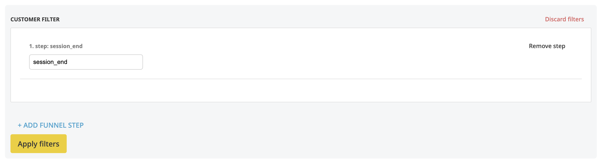

# Bloomreach FE filter

This is a proof-of-concept of an assignment to implement the customer filter logic in Angular.

To be brutal honest, I did not have much time to put into it, one, due to other applications and workload, and second, more important, we are going through a tough family situation right now which shuffled with my capacity throughout the last weeks.

For the past few years, I have either developed in vanilla JS or React. At my last job, I have progressively built an in-house custom framework in plain javascript, featuring store management, session control, api calls, history api, local storage and custom-compoments. My experience with Angular is from the times when the version number was a single digit ;) 

Due to the previous paragraph, I'm submitting this knowing that it's not feature-complete. But I felt like if there is a chance to move forward in the process, I should rather push what i have than nothing. I know that odds are not on my side but I've decided to go through nevertheless, and describe in this README, how would I apporach the stuff I haven't coded in yet, to at least somewhat showcase my skills in other ways possible.

### Install

- `npm install`
- `ng serve`
- `http://localhost:4200`

### Steps management

Although I have the `filterSteps` array to count and prefix its title, I was playing with the idea of abstracting the logic out of the component to CSS using the `counter-increment` rule. This way, I could simplify the component's readability, though I would have to document it for others for its unconventionality. 

### Sub-select elements

There are two options now, one is to have the `filter-step` component ready for the hardcoded attribute dropdown, second is to let the app adapt fot the API response and dynamically create the sub-sequent dropdowns based on the nested objects in the `events` response.

### Post Apply-filter data structure

My ideal structure would be the reflection of the endpoint. It's crucial to architect the data based on context, so I would need to know its later processing logic (DB storage, BE handling etc) but I would reconstruct the API call structure of an array of objects. The final array would have as many objects as there are form steps, in which the nested objects would store the attributes and the logical operators as strings.
I would likely make a JSON out of it and using the Fetch API call, send it to an endpoint in a verified manner.

### Styles

I have chosen SASS (in scss syntax) as it makes the most sense to me. The visual hierarchy just looks understandable and I can leverage its built-in functions. I did choose to make variable in native CSS format as I wanted to quicky tweak them in the browser. I'm not a fan of styled components as it really removes the "cascade" part of the CSS, but I'm able to play along ;) Same for tailwind, which puts us 25 years back to, really, inline-styles.